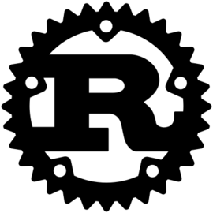
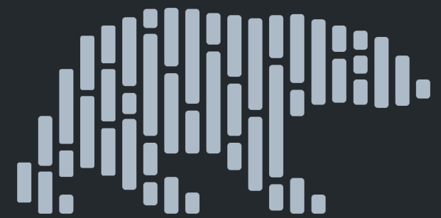
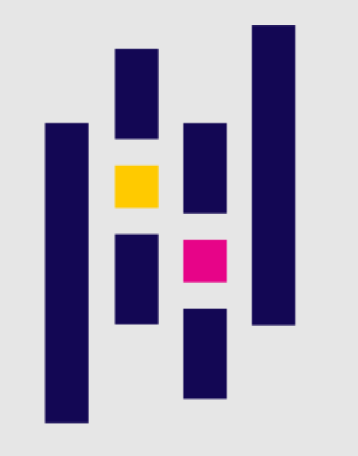

<!--
**ampsicora/ampsicora** is a ✨ _special_ ✨ repository because its `README.md` (this file) appears on your GitHub profile.

Here are some ideas to get you started:

- 🔭 I’m currently working on ...
- 🌱 I’m currently learning ...
- 👯 I’m looking to collaborate on ...
- 🤔 I’m looking for help with ...
- 💬 Ask me about ...
- 📫 How to reach me: ...
- 😄 Pronouns: ...
- ⚡ Fun fact: ...
-->

<h1 align="center" >Hi  there, I'm <a href="https://alessandro.sartori.io"> Alessandro</a> </h1>

         
         
         
         
         

 

         

Enthusiastic software engineer and SIAT certified technical analyst with skills in Python, Rust, PHP, and technical analysis.

Passionate about open source, blockchain, finance, and interested in learning more about Rust and machine learning.

Enjoying writing clear and quality code that can have a positive impact on people and make the world a better and easier place.

Always looking for new and challenging opportunities to learn and grow.
Particularly interested in projects that are innovative and have the potential to make a real difference in the world!

 

## 🛠 Languages and Tools:

         
|  RUST | PYTHON  |  PHP  |
|:-:|:-:|---|
|  <code></code>  |  <code></code>  |  <code></code> |
         
|  POLARS |  PANDAS |  LARAVEL |
|:-:|:-:|---|
| <code></code>  |  <code></code> |  <code></code> |
         

