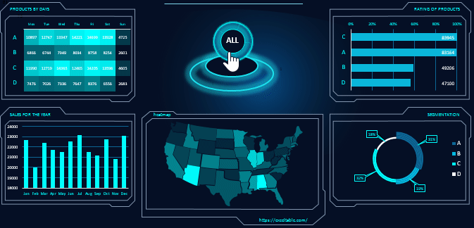

<!--
**tarikmanoar/tarikmanoar** is a ✨ _special_ ✨ repository because its `README.md` (this file) appears on your GitHub profile.

Here are some ideas to get you started:

- 🔭 I’m currently working on ...
- 🌱 I’m currently learning ...
- 👯 I’m looking to collaborate on ...
- 🤔 I’m looking for help with ...
- 💬 Ask me about ...
- 📫 How to reach me: ...
- 😄 Pronouns: ...
- ⚡ Fun fact: ...
-->

<h1 align="center" >Hi  there, I'm <a href="https://alessandro.sartori.io"> Alessandro</a> </h1>

         
         
         
         
         

 

         

## 🛠 **Languages and Tools:**  

 

 

| PYTHON  | PHP  |  LARAVEL |
|:-:|:-:|---|
|  <code></code> |  <code></code> |  <code></code> |

<!--
 

    

-->
<!--
|   |   |
| :------------: | :------------: |
-->

 

## 👉 [My GitHub Stats](https://skyline.github.com/ampsicora/2023) 📊

         

         

